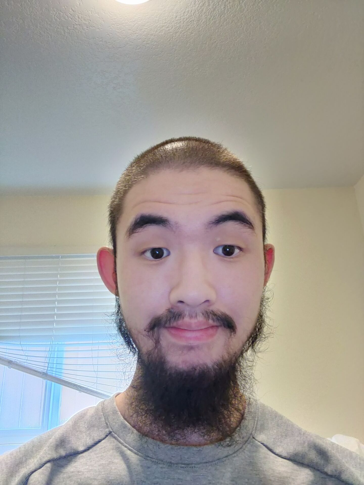
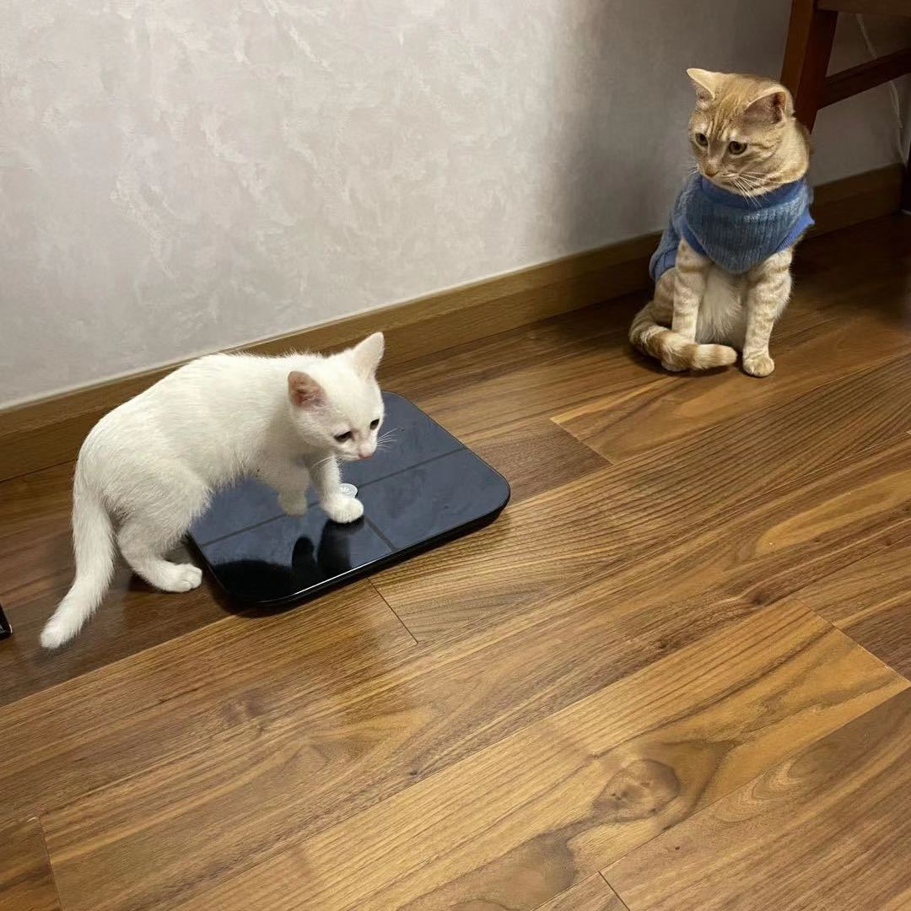

# Welcome to my User Page

<sub>Click here to jump to sections [Introduction of myself as a person](#introduction-of-myself-as-a-person), [Introduction of myself as a programer](#introduction-of-myself-as-a-programer).

```
int main(){
    cout<<"Hello everyone!!! Welcome!!!";
    return 0;
}
```
## ***Hello everyone!!! Welcome!!!*** 

<sub> This is me.

## Introduction of myself as a person
My name is **Chengtao Wu**. I was born and raised in Shanghai. I am currently a student of [UCSD](https://ucsd.edu/) majoring in Computer Engineering. 

Here is an ordered list of things that I do during my spare time.
   1. workout
   2. playing with my cats
   3. solving [Leetcode problems](https://leetcode.com/problems/)
   4. playing video games

And here is the list of things that I want to do this year.
- [ ] gain more muscle
- [ ] solve more Hard leetcode problems
- [ ] spend more time with my family

*When talking about family, here is a picture of my cats*

<sub> If you want to see more pictures of my cats, click the following links. -> [cat](1.jpg) [cat](3.jpg) [cat](4.jpg) [cat](5.jpg) 


## Introduction of myself as a programer

I took my first course about computer science when I was in high school, and that was the time I knew want to study in college. Computer and Internet are great and powerful tools for the society.

*Here is a quote that shows how powerful computers and Internet are.*
> Across the Great Wall, we can reach every corner in the world.


During my time in UCSD, I have learned more about these programing languages.
* c++
* java
* python

But just learning programing language is not enough to do well on programing. Practice is also essiential. This is why I also spend my time on Leetcode problems during my spare time. 

Everytime when I met some diffcult leetcode problems, I would usually try to find out the pattern that I might missed, and try my best to solve it by myself without looking solution. And I found out that I enjoyed solving leetcode problems, especially the hard ones. 

Therefore, I would consider myself as a programer who enjoys solving diffcult problems.


